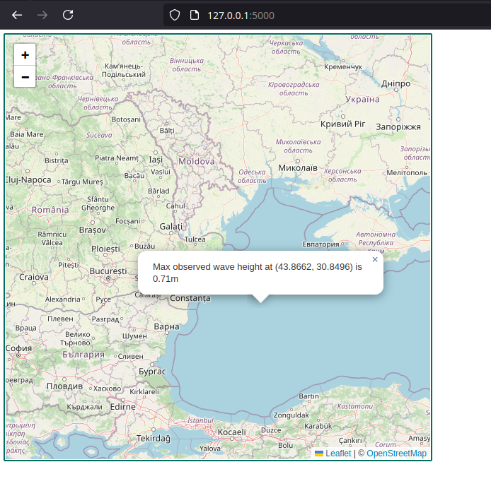

# Solar Picker

Use interactive map to explore the wave height all over the world.

## For developers

### Build and run

Build: `./run.sh build`
Run: `./run.sh run`

Then the page will be available on: http://127.0.0.1:5000

### Frontend

* Is a static html / vanilla js.
* It is using es modules, therefore requires a web server for security reasons
* Formatted with Prettier, linted with EsLint

### Backend

* FastAPI based web server
* For the sake of the exercise CORS allows all hosts - not very safe.
* Using pyproject.toml to configure dependencies
* Black for formatting, ruff for linting
* Although the data file in `backend/src/static` was pushed to github,
    in production it should be, at least, mounted into the docker container instead.
    [Dockerfile](docker/Dockerfile) and [run.sh](./run.sh) reflect this properly.
